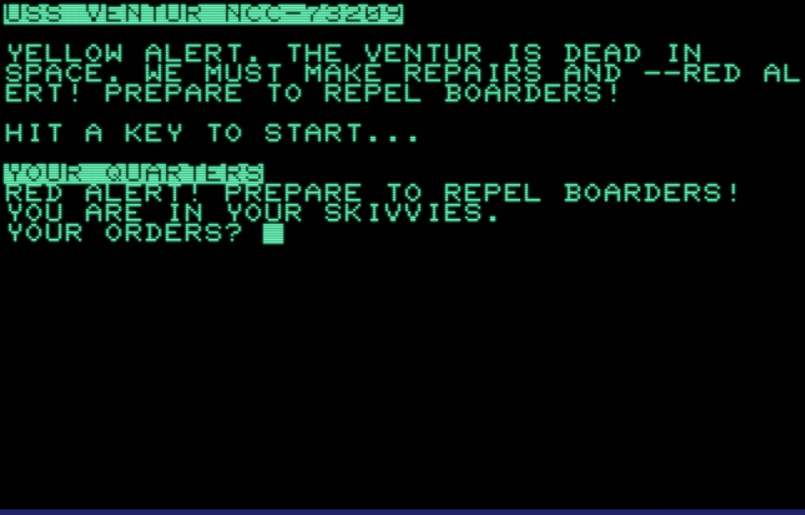

# VENTUR, a text adventure

Welcome to the USS Ventur! You are an ensign who must, among other things, figure out how to get dressed, get around
the ship, and save the day!

## Installing

This version should work on all Commodore BASIC machines. It was specifically tested on the PET emulator
at https://www.masswerk.at/pet/

There are two versions:
  * [venmax.bas](venmax.bas) - Verbose source code text, with comments
  * [ventur.bas](ventur.bas) - Minimized source code text. Converted from `venmax.bas` via my own script

## How to play

Use `help` in-game. I don't want to give too much away!

