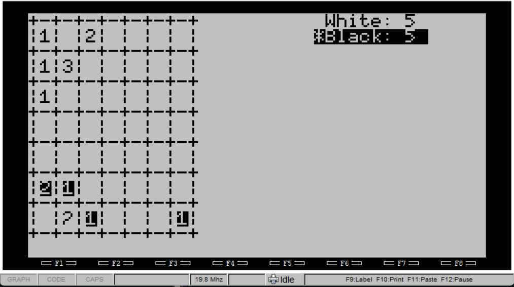
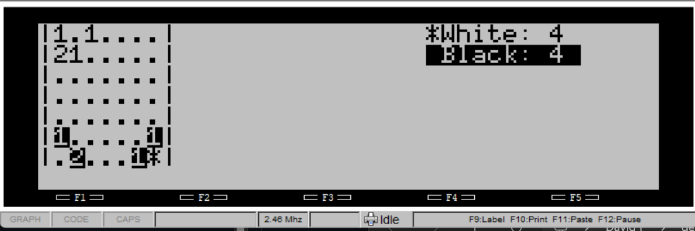

# Crit

## Description

This is a "Critical mass" or "Chain reaction"-type game for one or two players.

Use up/down/left/right to pick a cell, then enter to drop a "pellet". If there
are too many pellets (more than 1 in the corners, 2 on the edges, or 3 internally),
the cell "explodes" and spreads to the neighboring cells.

CRIT.DO is for the 200/100/102/M-10. It adjusts the display to show a larger
grid on the 200:

CRITN.DO is for the 8201/8300:

## AI assistance

I wrote a two-player version of the game, then worked with Google Gemini on
the implementation of the computer player algorithm. The computer algorithm
mostly came from Gemini.

Gemini also wrote the "win" test.
