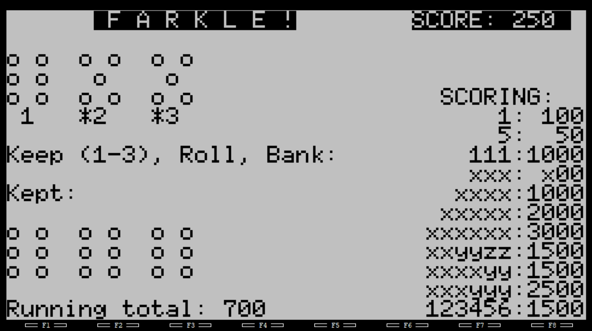

# Farkle (FARK) for Tandy 200

Play the classic dice game on your Tandy 200!

Can you get to 5000 points in 10 rolls or less?

## Gameplay

Each turn consists of several rolls using six dice:
1. Initial Roll: Roll all six dice. 
1. Select at least one "scoring" die. Use the 1 through 6 keys to select (or deselect) dice.
1. The Decision: After setting aside scoring dice, you have two choices:
   1. Bank ("b" key): Stop rolling and add your current turn's running total to your permanent score. Includes all "selected" dice.
   1. Roll ("r" key): Keep selected dice, and re-roll the unselected dice to increase your running total.
1. FARKLE: If you roll and no scoring combinations are possible from the dice on the table, you "Farkle." You lose all points in the running total during that specific turn.

Note: You must select at least one die to "re-roll", and you must have a non-zero running total to "bank".

## Scoring

* 1: 100 each (when not part of a larger meld)
* 5: 50 each (when not part of a larger meld)
* 111: 1000
* 222: 200
* 333: 300
* 444: 400
* 555: 500
* 666: 600
* Four of a kind: 1000
* Four of a kind and one pair: 1500
* Five of a kind: 2000
* Six of a kind: 3000
* Three pairs: 1500
* Two triples: 2500
* Straight (123456): 1500

## Known issues

These are bugs:

* You can "keep" dice that are not part of a meld
* You can play forever; there is no turn limit yet
