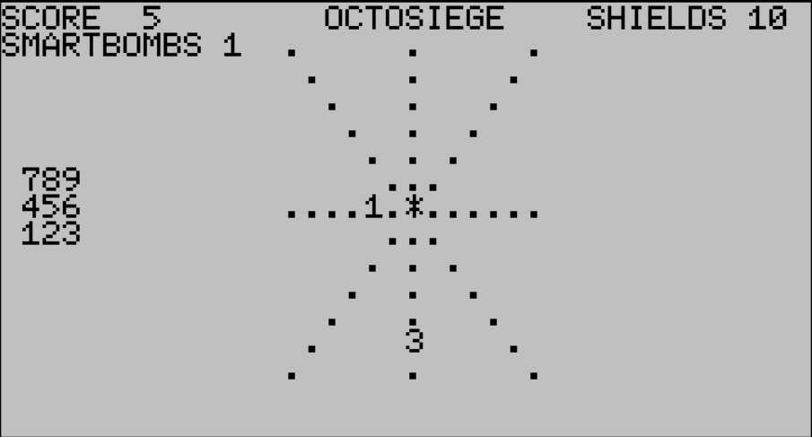

# OCTOSIEGE - a 10 line BASIC game

## Gameplay

Defend the center from the invading aliens! You can fire from the center in all 8 directions using the
numeric keypad. An alien can take up to 3 hits before it dies - but watch out - if any of them reach you
in the middle they'll decrease your shields!

You only get TWO smartbombs, which kills all aliens instantly. Use them wisely!



This is all done in just 10 lines of 120-characters!

## Code with Description

[Full code](./OCTO10.DO)

### Variables
* C=300, center location on screen
* H=shields level
* W=40, screen width
* Z=48, ASCII "0"
* M=# of smart bombs left
* N=# of aliens
* B=bullet location (0 if none)
* D=delta bullet location
* I=current alien number
* S=score
* E(I)=enemy location on screen
* T(I)=enemy type (1-3)
* S(I)=enemy strength (1-3, decreases with each hit)

### Code

C=center H=shields W=width Z=48 (ASCII zero) M=smart bombs. Seed random number generator. Draw banner/header.
```
0CLS:DEFINTA-Z:C=300:H=10:W=40:Z=48:M=2+RND(-PEEK(61983)):D$=".":?"SCORE"S,"  OCTOSIEGE    SHIELDS"H"SMARTBOMBS"M
```

Draw board. Set up first alien (gosub 9) in slot I.
```
1?@240,789:?456:?123:FORJ=1TO13:?@(293+J),D$:?@(J*W+13+J),D$:?@(J*W+20),D$:?@(J*W+27-J),D$:NEXT:GOSUB9:?@C,"*
```

Get keyboard input. B is the bullet location; D is the "delta" to add to the bullet location for each iteration.
A=distance of bullet to edge. Draw initial bullet.
```
2K=VAL(INKEY$):IFKANDK<>5THEND=(KMOD3=1)-(KMOD3=0)+W*((K>6)-(K<4)):B=C+D:A=6:?@B,"o
```

Activate smart bomb. Loop through all aliens, add their strength to the score, erase them.
```
3IFK=5ANDMTHENM=M-1:?@50,M:FORJ=0TON:FORP=0TOZ:NEXT:IFT(J)THEN?@E(J),"*":S=S+S(J):?@5,S:T(J)=0:?@E(J),D$:NEXTELSENEXT
```

Increase N (# of aliens) for every 20 points of score. Max at 9. Look at next alien I. If it exists, see if the
bullet hit it already (gosub 8). Otherwise, maybe add a new alien in this slot (gosub 9)
```
4N=3+S/20:N=(N+9-ABS(N-9))/2:I=(I+1)MOD(N+1):J=I:E=E(I):IFT(I)THENGOSUB8ELSEIFRND(1)<.15THENGOSUB9:GOTO7ELSE7
```

If there is still an alien alien in slot I, erase it, move it towards the center, and redraw it. Store its new
location E in E(I).
```
5IFT(I)=0THEN7ELSE?@E,D$:X=EMODW-20:Y=E\W-7:E=C+X-SGN(X)+(Y-SGN(Y))*W:?@E,CHR$(Z+S(I)):E(I)=E
```

If the current alien reached the center, beep and decrease shields H by its type T. If shields gave fallen, game over.
```
6IFE=CTHEN?@C,"X":BEEP:FORK=0TO900:NEXT:H=H-T(I):T(I)=0:?@37,H:?@C,"*":IFH<=0THEN?@C-4,"GAME OVER":END
```

Test if the bullet has hit each alien J. If there is still a bullet in play, erase it, move it until A=0.
```
7FORJ=0TON:E=E(J):GOSUB8:NEXT:IFB=0THEN2ELSE?@B,D$:A=A-1:IFATHENB=B+D:?@B,"o":GOTO4ELSEB=0:GOTO2
```

(Subroutine) Check if the alien location E is the same as bullet location B and alien J exists. If so,
decrease alien J's strength. If it hasn't reached 0, draw its new strength. If it has, increase player's score S
by the original alien Type.
```
8IFE<>BORT(J)=0THENRETURNELSEP=S(J)-1:S(J)=P:B=0:IFPTHEN?@E,CHR$(Z+P):RETURNELSES=S+T(J):?@5,S:T(J)=0:?@E,D$:RETURN
```

(Subroutine) Spawn a new alien at slot I, and draw it at its spot.
```
9P=RND(1)*8:P=P-(P>3):E(I)=C+(P-(P\3)*3-1)*6+W*((P\3)-1)*6:P=1+3*RND(1):T(I)=P:S(I)=P:?@E(I),CHR$(Z+P):RETURN
```

## AI Assistance

I tried to "vibe-code" a version of Octosiege with Google Gemini, but it didn't go well.
(Gemini came up with the name, which I kept.)

I started over from scratch, writing 95% of the above code. I got some help from
Gemini (with my guidance) to avoid the use of if/then/else on lines 4, 5 ad 9.
