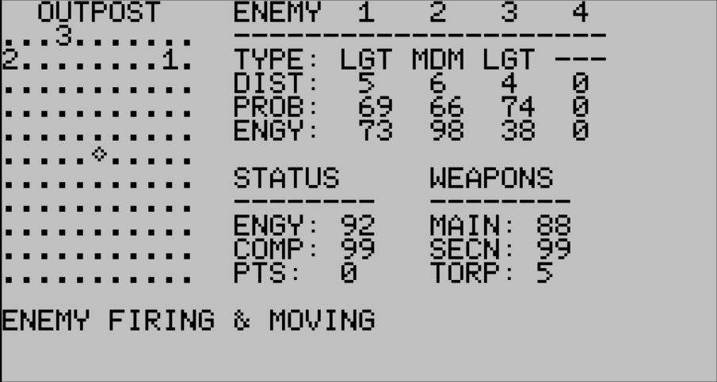

# Outpost

Ported from Commodore PET BASIC. Currently only for Tandy 200

Based on outpost.prg
https://www.commodoregames.net/CommodorePET/Outpost-437.html

Original author unknown.

## How to play

Defend your outpost from invading enemies! Kill all enemies before your
energy runs out, or they reach you at the center of the radar.

You have three weapons at your disposal: Mains, Secondaries and Torpedoes.

If there are no enemies in sight, you can Charge.

After you pick your weapon, fire it at the enemy number of your choice.

A supply ship (S) sometimes will come by and restore your energy, computer and weapons.
