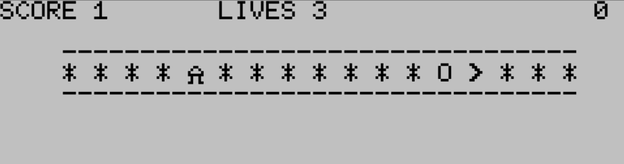
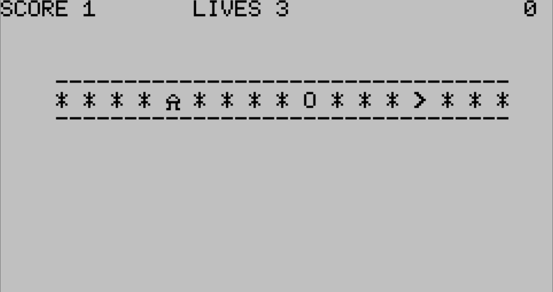

# PAC1

A 1-D version of that famous arcade game where you run around eating pellets
and avoiding ghoulish baddies. If you eat a "power" pellet, the ghoulish 
baddie becomes temporarily vulnerable, and then you can eat THEM!

Clear the board and you get an extra life. Can you beat your high score?

...and all done in 10 lines of 80 characters or less!

## Directions

Use the `j` key to go left and the `l` (lower case `L`) key to go right.

## Scoring

Get 1 point for eating a pellet, 10 for a power pellet, and 20 for
eating the baddie when they're vulnerable.

## Versions

All versions have the same gameplay, they just look a little different.

The `0` in the upper right corner is the timer for how long the baddie
is "vulnerable". It starts at 50 and counts down to zero. When it hits
zero, stay away!

### PAC1.DO

For Tandy 100/102 only:

### PAC200.DO

For Tandy 200 only:

## Credits/Inspirations

Google Gemini was used to simplify some logic but the vast majority of
the code was written by a human.

Inspired by [Pac-Line](https://sizescape.itch.io/pac-line) and
[Paku Paku](https://abagames.github.io/crisp-game-lib-11-games/?pakupaku)
