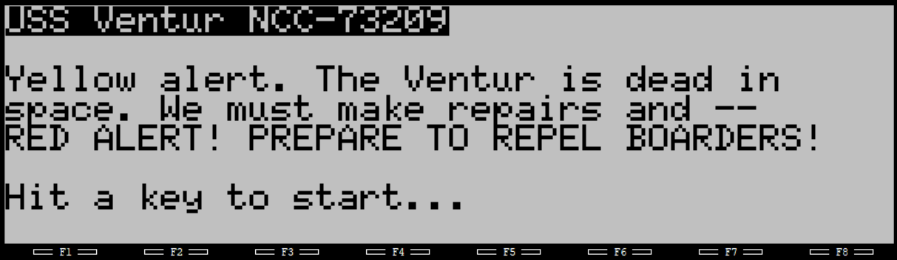
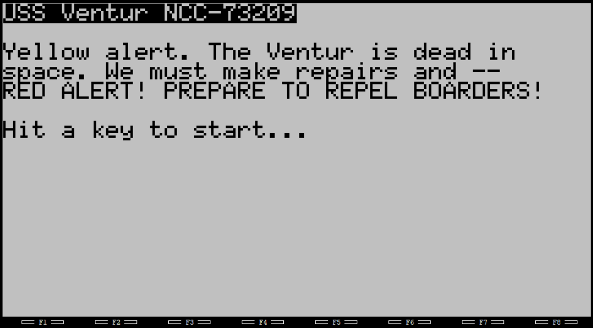

# VENTUR, a text adventure

Welcome to the USS Ventur! You are an ensign who must, among other things, figure out how to get dressed, get around
the ship, and save the day!

Tandy 100/102:

Tandy 200:

## Installing

The game works on the Tandy 100/102 and the 200.

There are three versions:
  * [venmax.do](venmax.do) - Verbose source code text, with comments
  * [ventur.do](ventur.do) - Minimized source code text. Converted from `venmax.do` via my own script
  * [ventur.ba](ventur.ba) - Tokenized/binary version

The verbose source is over 13k, so you may have trouble loading it on your Model-T if it has less than 32K of RAM.
Even the minimized source code might still be too big to load into 24K of RAM.

The tokenized version is around 8.5k so you will be OK with as little as 16k of RAM.

## How to play

Use `help` in-game. I don't want to give too much away!

